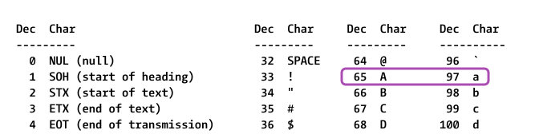
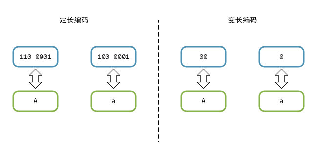
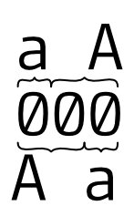
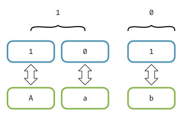

# 哈夫曼编码(Huffman coding)介绍

## 什么是哈夫曼编码

一种无损编码文本的方法, 能起到压缩文件体积的效果

## 定长与变长编码

### 什么是定长编码, 什么是变长编码

ascii编码是经典的定长编码, 使用7bit来表示一个字符 

比如 a 用 110 0001 表示, A 用 100 0001, 可表示的字符数量为 2^7 = 128 个



变长编码是用不同长度的符号来表示一组符号的方式

比如 a 可以用 0 表示, A 可以用 00 表示




### 为什么我们要关心变长, 定长编码

显而易见的是, 变长编码在很多情况下会比定长编码**节约空间**

用 7bit 来表示一个字母 a 显然不如用 1bit 的 0 来表示 a 有效率(保存同等信息时, 占用更少空间)

## 无歧义的前缀

### 变长编码可能会有二义性

前面的例子里, 变长编码的 a 和 A 分别用 0 和 00 表示, 当我们有一串文本 aA 需要保存时, 可以在文件里写入 000

当我们需要还原保存的文本时, 一个显而易见的问题来了, 000 如何解析

我们可以把它解析为 aA, aaa, Aa 三种文本, 哪个才是原来保存的文本?



这带来了二义性

*注: 定长编码没有二义性的问题*

### 二义性怎么产生的

这个二义性的是 a (0) 可以作为 A(00) 的前缀导致的

解析时在读取一个 0 获得 a 后是否应该继续解析?

### 怎么解决二义性

**任意字符的编码不可以作为别的字符的编码的前缀**

a 可以用 0 表示, A 用 1 表示, 就消除了二义性

如果又增加一个字母b, 怎么办?

a 和 A 已经表示好了, 这两个字符作为一组, 记为 **G**, **G** 可以用1表示

这又回到两个字符的场景, 只要 **G** 和 b 互不为对方的前缀即可, **G** 用 1 表示, b 用 0 表示

展开 **G**, 此时 a 用 10 , A 用 11 表示, 而 b 用 01 表示



aAb 这串字符可以存为 101101

## 压缩空间

一个现象: 文本里各个字母出现的频率是不同的


*来自: http://pi.math.cornell.edu/~mec/2003-2004/cryptography/subs/frequencies.html*

使用变长编码时, 常见的字母可以少用一些bit来表示, 少见的字母可以多用一些bit来表示 

## 哈夫曼编码的思想

上述就是哈夫曼编码的思想: 变长编码+高频字符用更短编码表示

## 实现示例

代码在`src/main.ts`里, 需要node环境

`npm i`安装依赖, `npm start`运行

这里使用音游Deemo里的一首曲子Nine point eight做为素材


统计各个字符的数量, 进行排序

``` js
[
  { id: 'vYOeWdBsCY7kv_xfZwG3t', count: 1, letter: '2' },
  { id: 'fUODksZ-C9vbvOuUk0OrU', count: 1, letter: '^' },
  { id: 'w6mN0GUnNswnlzFOLhDWj', count: 1, letter: '/' },
  { id: 'bdnjhC-9ABTRQS80NAC3W', count: 1, letter: '8' },
  { id: 'EMaxk1mZiJDQqliXr0ct1', count: 1, letter: '9' },
  { id: 'EaZRJ31tsf6Y9C74wTuhr', count: 1, letter: 'J' },
  { id: 'uXG60tk_RAarZEdtSlklG', count: 1, letter: 'Z' },
  { id: '3OoVGQp3Drr_1wbVWagIl', count: 1, letter: 'F' },
  { id: 'Vi4atTq5TGBWrfSztMmiZ', count: 1, letter: 'B' },
  { id: 'c6V9HfU_MvsD1ObMVz6GA', count: 1, letter: '1' },
  { id: 'eOuX2wmSF4wwdKB2BYvyj', count: 1, letter: 'V' },
  { id: 'GxOgGBalL6CayQsEw70AH', count: 1, letter: 'E' },
  { id: '4tX2XVEILqYDpN_G0oKgd', count: 1, letter: 'N' },
  { id: 'mYmdZk3BgQQ_xADWigZZ1', count: 2, letter: 'H' },
  { id: 'J8kbJKYExH9CIPoGcs8l_', count: 2, letter: 'L' },
  { id: 'S-B01pUro_gU8sSs7U29l', count: 2, letter: "'" },
  { id: 'OFuaCZ976jhSt3lM5N_YC', count: 2, letter: '.' },
  { id: 'Yq5L9AGkEdfaU-i-LvLKh', count: 2, letter: 'O' },
  { id: '3CsgENXvtx7auJIC-zGlj', count: 2, letter: 'D' },
  { id: '0lLZ5u8is32-VZDeF5AKG', count: 2, letter: 'M' },
  { id: 'ZDxUh0UFnceMeLifl9exN', count: 3, letter: 'z' },
  { id: '-vGbDCeXEG1WQeP8O_v0W', count: 3, letter: 'P' },
  { id: 'MxSZd-0wZpU8D1-PwP2Kb', count: 4, letter: 'j' },
  { id: 'bIacqxFtV8VNGls1C_Gb7', count: 4, letter: 'C' },
  { id: 'NbYaJJdF7GkYh5BfxztZr', count: 5, letter: 'S' },
  { id: 'jB-7Tbbkfg__aMcPHOmpb', count: 6, letter: 'T' },
  { id: 'iXY9jT9gU76bBu_9EuEYm', count: 7, letter: 'A' },
  { id: '7YDxvjAiyTn20XRxqWweP', count: 10, letter: 'I' },
  { id: 'i4dEYXx-FkAzatItzQn6W', count: 10, letter: 'v' },
  { id: 'EQ7rJcd5vZtIADfXZJ5qy', count: 13, letter: ',' },
  { id: 'UtAAetutuQYLJoJa-s1pa', count: 14, letter: 'b' },
  { id: 'lvX9OwWLrY-X71XBHTi42', count: 14, letter: 'k' },
  { id: 'A9TDsoCRsKRU_wyq5UQxG', count: 18, letter: 'w' },
  { id: 'rYazA943Cg0jhIZO9Tb9f', count: 19, letter: 'g' },
  { id: 'lu5hNLFvkcSaYZ7D7oSbL', count: 22, letter: 'f' },
  { id: 'HfApuyV33qkerI2P13ITe', count: 23, letter: 'p' },
  { id: 'sUG7ILNXckRjR-1bbIb4U', count: 29, letter: 'c' },
  { id: 'A2P8Sy5sxZaL5ut6LoIH1', count: 32, letter: 'd' },
  { id: 'yB5uOP4jbOTbYCfazY_mx', count: 35, letter: 'm' },
  { id: '3aqzHqmyNDbbDR41ev_RS', count: 38, letter: 'y' },
  { id: 'a9l0Sol3r4ucBCXNQmE0m', count: 39, letter: 'h' },
  { id: 'qQntW2gQWGD_cCfwvaeID', count: 47, letter: 'u' },
  { id: 'XK1d1h4Q02ORGDmfxyM3D', count: 59, letter: 'l' },
  { id: 'v2RIvxEBKJZjIoqohCXH8', count: 62, letter: 'r' },
  { id: 'qvW_GtFTFesJn_DPowY1q', count: 63, letter: 's' },
  { id: 'B7Ocl8NEdVmrK6xvWCkP1', count: 63, letter: 'n' },
  { id: 'EH_Ct7ToPEcnZDwNOmacp', count: 65, letter: 't' },
  { id: 'Ao-5BkuEJccgstxnaEH_5', count: 67, letter: '\n' },
  { id: 'VYT8EBPLecTW0U9sBmFBe', count: 69, letter: 'a' },
  { id: 'pYuiFCyqb34n63pJ_774f', count: 71, letter: 'i' },
  { id: '2YdV0sNtpmD_aH_JigDMA', count: 90, letter: 'o' },
  { id: 'PlXdTX4h0qeq2f33cALiG', count: 122, letter: 'e' },
  { id: 'Cwb-InQ8_xe9b-dA1iKzI', count: 191, letter: ' ' }
]
```

构建出一颗树

```
├─ 0
│  ├─ 0
│  │  ├─ 0
│  │  │  ├─ 0
│  │  │  │  ├─ letter: s
│  │  │  │  └─ path: 0000
│  │  │  ├─ 1
│  │  │  │  ├─ letter: n
│  │  │  │  └─ path: 0001
│  │  │  └─ count: 126
│  │  ├─ 1
│  │  │  ├─ 0
│  │  │  │  ├─ letter: t
│  │  │  │  └─ path: 0010
│  │  │  ├─ 1
│  │  │  │  ├─ 0
│  │  │  │  │  ├─ letter: d
│  │  │  │  │  └─ path: 00110
│  │  │  │  ├─ 1
│  │  │  │  │  ├─ 0
│  │  │  │  │  │  ├─ 0
│  │  │  │  │  │  │  ├─ 0
│  │  │  │  │  │  │  │  ├─ 0
│  │  │  │  │  │  │  │  │  ├─ letter: .
│  │  │  │  │  │  │  │  │  └─ path: 001110000
│  │  │  │  │  │  │  │  ├─ 1
│  │  │  │  │  │  │  │  │  ├─ letter: O
│  │  │  │  │  │  │  │  │  └─ path: 001110001
│  │  │  │  │  │  │  │  └─ count: 4
│  │  │  │  │  │  │  ├─ 1
│  │  │  │  │  │  │  │  ├─ 0
│  │  │  │  │  │  │  │  │  ├─ letter: L
│  │  │  │  │  │  │  │  │  └─ path: 001110010
│  │  │  │  │  │  │  │  ├─ 1
│  │  │  │  │  │  │  │  │  ├─ letter: '
│  │  │  │  │  │  │  │  │  └─ path: 001110011
│  │  │  │  │  │  │  │  └─ count: 4
│  │  │  │  │  │  │  └─ count: 8
│  │  │  │  │  │  ├─ 1
│  │  │  │  │  │  │  ├─ 0
│  │  │  │  │  │  │  │  ├─ letter: C
│  │  │  │  │  │  │  │  └─ path: 00111010
│  │  │  │  │  │  │  ├─ 1
│  │  │  │  │  │  │  │  ├─ letter: S
│  │  │  │  │  │  │  │  └─ path: 00111011
│  │  │  │  │  │  │  └─ count: 9
│  │  │  │  │  │  └─ count: 17
│  │  │  │  │  ├─ 1
│  │  │  │  │  │  ├─ letter: w
│  │  │  │  │  │  └─ path: 001111
│  │  │  │  │  └─ count: 35
│  │  │  │  └─ count: 67
│  │  │  └─ count: 132
│  │  └─ count: 258
│  ├─ 1
│  │  ├─ 0
│  │  │  ├─ 0
│  │  │  │  ├─ letter:
│  │  │  │  └─ path: 0100
│  │  │  ├─ 1
│  │  │  │  ├─ letter: a
│  │  │  │  └─ path: 0101
│  │  │  └─ count: 136
│  │  ├─ 1
│  │  │  ├─ 0
│  │  │  │  ├─ letter: i
│  │  │  │  └─ path: 0110
│  │  │  ├─ 1
│  │  │  │  ├─ 0
│  │  │  │  │  ├─ letter: m
│  │  │  │  │  └─ path: 01110
│  │  │  │  ├─ 1
│  │  │  │  │  ├─ letter: y
│  │  │  │  │  └─ path: 01111
│  │  │  │  └─ count: 73
│  │  │  └─ count: 144
│  │  └─ count: 280
│  └─ count: 538
├─ 1
│  ├─ 0
│  │  ├─ 0
│  │  │  ├─ 0
│  │  │  │  ├─ 0
│  │  │  │  │  ├─ 0
│  │  │  │  │  │  ├─ letter: g
│  │  │  │  │  │  └─ path: 100000
│  │  │  │  │  ├─ 1
│  │  │  │  │  │  ├─ 0
│  │  │  │  │  │  │  ├─ letter: I
│  │  │  │  │  │  │  └─ path: 1000010
│  │  │  │  │  │  ├─ 1
│  │  │  │  │  │  │  ├─ letter: v
│  │  │  │  │  │  │  └─ path: 1000011
│  │  │  │  │  │  └─ count: 20
│  │  │  │  │  └─ count: 39
│  │  │  │  ├─ 1
│  │  │  │  │  ├─ letter: h
│  │  │  │  │  └─ path: 10001
│  │  │  │  └─ count: 78
│  │  │  ├─ 1
│  │  │  │  ├─ letter: o
│  │  │  │  └─ path: 1001
│  │  │  └─ count: 168
│  │  ├─ 1
│  │  │  ├─ letter:
│  │  │  └─ path: 101
│  │  └─ count: 359
│  ├─ 1
│  │  ├─ 0
│  │  │  ├─ 0
│  │  │  │  ├─ 0
│  │  │  │  │  ├─ 0
│  │  │  │  │  │  ├─ letter: f
│  │  │  │  │  │  └─ path: 110000
│  │  │  │  │  ├─ 1
│  │  │  │  │  │  ├─ letter: p
│  │  │  │  │  │  └─ path: 110001
│  │  │  │  │  └─ count: 45
│  │  │  │  ├─ 1
│  │  │  │  │  ├─ letter: u
│  │  │  │  │  └─ path: 11001
│  │  │  │  └─ count: 92
│  │  │  ├─ 1
│  │  │  │  ├─ 0
│  │  │  │  │  ├─ 0
│  │  │  │  │  │  ├─ 0
│  │  │  │  │  │  │  ├─ 0
│  │  │  │  │  │  │  │  ├─ 0
│  │  │  │  │  │  │  │  │  ├─ 0
│  │  │  │  │  │  │  │  │  │  ├─ letter: N
│  │  │  │  │  │  │  │  │  │  └─ path: 1101000000
│  │  │  │  │  │  │  │  │  ├─ 1
│  │  │  │  │  │  │  │  │  │  ├─ 0
│  │  │  │  │  │  │  │  │  │  │  ├─ letter: V
│  │  │  │  │  │  │  │  │  │  │  └─ path: 11010000010
│  │  │  │  │  │  │  │  │  │  ├─ 1
│  │  │  │  │  │  │  │  │  │  │  ├─ letter: E
│  │  │  │  │  │  │  │  │  │  │  └─ path: 11010000011
│  │  │  │  │  │  │  │  │  │  └─ count: 2
│  │  │  │  │  │  │  │  │  └─ count: 3
│  │  │  │  │  │  │  │  ├─ 1
│  │  │  │  │  │  │  │  │  ├─ letter: z
│  │  │  │  │  │  │  │  │  └─ path: 110100001
│  │  │  │  │  │  │  │  └─ count: 6
│  │  │  │  │  │  │  ├─ 1
│  │  │  │  │  │  │  │  ├─ letter: T
│  │  │  │  │  │  │  │  └─ path: 11010001
│  │  │  │  │  │  │  └─ count: 12
│  │  │  │  │  │  ├─ 1
│  │  │  │  │  │  │  ├─ letter: ,
│  │  │  │  │  │  │  └─ path: 1101001
│  │  │  │  │  │  └─ count: 25
│  │  │  │  │  ├─ 1
│  │  │  │  │  │  ├─ 0
│  │  │  │  │  │  │  ├─ 0
│  │  │  │  │  │  │  │  ├─ 0
│  │  │  │  │  │  │  │  │  ├─ letter: P
│  │  │  │  │  │  │  │  │  └─ path: 110101000
│  │  │  │  │  │  │  │  ├─ 1
│  │  │  │  │  │  │  │  │  ├─ 0
│  │  │  │  │  │  │  │  │  │  ├─ letter: D
│  │  │  │  │  │  │  │  │  │  └─ path: 1101010010
│  │  │  │  │  │  │  │  │  ├─ 1
│  │  │  │  │  │  │  │  │  │  ├─ letter: M
│  │  │  │  │  │  │  │  │  │  └─ path: 1101010011
│  │  │  │  │  │  │  │  │  └─ count: 4
│  │  │  │  │  │  │  │  └─ count: 7
│  │  │  │  │  │  │  ├─ 1
│  │  │  │  │  │  │  │  ├─ letter: A
│  │  │  │  │  │  │  │  └─ path: 11010101
│  │  │  │  │  │  │  └─ count: 14
│  │  │  │  │  │  ├─ 1
│  │  │  │  │  │  │  ├─ letter: b
│  │  │  │  │  │  │  └─ path: 1101011
│  │  │  │  │  │  └─ count: 28
│  │  │  │  │  └─ count: 53
│  │  │  │  ├─ 1
│  │  │  │  │  ├─ 0
│  │  │  │  │  │  ├─ letter: c
│  │  │  │  │  │  └─ path: 110110
│  │  │  │  │  ├─ 1
│  │  │  │  │  │  ├─ 0
│  │  │  │  │  │  │  ├─ letter: k
│  │  │  │  │  │  │  └─ path: 1101110
│  │  │  │  │  │  ├─ 1
│  │  │  │  │  │  │  ├─ 0
│  │  │  │  │  │  │  │  ├─ 0
│  │  │  │  │  │  │  │  │  ├─ 0
│  │  │  │  │  │  │  │  │  │  ├─ 0
│  │  │  │  │  │  │  │  │  │  │  ├─ letter: B
│  │  │  │  │  │  │  │  │  │  │  └─ path: 11011110000
│  │  │  │  │  │  │  │  │  │  ├─ 1
│  │  │  │  │  │  │  │  │  │  │  ├─ letter: 1
│  │  │  │  │  │  │  │  │  │  │  └─ path: 11011110001
│  │  │  │  │  │  │  │  │  │  └─ count: 2
│  │  │  │  │  │  │  │  │  ├─ 1
│  │  │  │  │  │  │  │  │  │  ├─ 0
│  │  │  │  │  │  │  │  │  │  │  ├─ letter: Z
│  │  │  │  │  │  │  │  │  │  │  └─ path: 11011110010
│  │  │  │  │  │  │  │  │  │  ├─ 1
│  │  │  │  │  │  │  │  │  │  │  ├─ letter: F
│  │  │  │  │  │  │  │  │  │  │  └─ path: 11011110011
│  │  │  │  │  │  │  │  │  │  └─ count: 2
│  │  │  │  │  │  │  │  │  └─ count: 4
│  │  │  │  │  │  │  │  ├─ 1
│  │  │  │  │  │  │  │  │  ├─ letter: j
│  │  │  │  │  │  │  │  │  └─ path: 110111101
│  │  │  │  │  │  │  │  └─ count: 8
│  │  │  │  │  │  │  ├─ 1
│  │  │  │  │  │  │  │  ├─ 0
│  │  │  │  │  │  │  │  │  ├─ 0
│  │  │  │  │  │  │  │  │  │  ├─ 0
│  │  │  │  │  │  │  │  │  │  │  ├─ letter: 2
│  │  │  │  │  │  │  │  │  │  │  └─ path: 11011111000
│  │  │  │  │  │  │  │  │  │  ├─ 1
│  │  │  │  │  │  │  │  │  │  │  ├─ letter: ^
│  │  │  │  │  │  │  │  │  │  │  └─ path: 11011111001
│  │  │  │  │  │  │  │  │  │  └─ count: 2
│  │  │  │  │  │  │  │  │  ├─ 1
│  │  │  │  │  │  │  │  │  │  ├─ letter: H
│  │  │  │  │  │  │  │  │  │  └─ path: 1101111101
│  │  │  │  │  │  │  │  │  └─ count: 4
│  │  │  │  │  │  │  │  ├─ 1
│  │  │  │  │  │  │  │  │  ├─ 0
│  │  │  │  │  │  │  │  │  │  ├─ 0
│  │  │  │  │  │  │  │  │  │  │  ├─ letter: 9
│  │  │  │  │  │  │  │  │  │  │  └─ path: 11011111100
│  │  │  │  │  │  │  │  │  │  ├─ 1
│  │  │  │  │  │  │  │  │  │  │  ├─ letter: J
│  │  │  │  │  │  │  │  │  │  │  └─ path: 11011111101
│  │  │  │  │  │  │  │  │  │  └─ count: 2
│  │  │  │  │  │  │  │  │  ├─ 1
│  │  │  │  │  │  │  │  │  │  ├─ 0
│  │  │  │  │  │  │  │  │  │  │  ├─ letter: /
│  │  │  │  │  │  │  │  │  │  │  └─ path: 11011111110
│  │  │  │  │  │  │  │  │  │  ├─ 1
│  │  │  │  │  │  │  │  │  │  │  ├─ letter: 8
│  │  │  │  │  │  │  │  │  │  │  └─ path: 11011111111
│  │  │  │  │  │  │  │  │  │  └─ count: 2
│  │  │  │  │  │  │  │  │  └─ count: 4
│  │  │  │  │  │  │  │  └─ count: 8
│  │  │  │  │  │  │  └─ count: 16
│  │  │  │  │  │  └─ count: 30
│  │  │  │  │  └─ count: 59
│  │  │  │  └─ count: 112
│  │  │  └─ count: 204
│  │  ├─ 1
│  │  │  ├─ 0
│  │  │  │  ├─ 0
│  │  │  │  │  ├─ letter: l
│  │  │  │  │  └─ path: 11100
│  │  │  │  ├─ 1
│  │  │  │  │  ├─ letter: r
│  │  │  │  │  └─ path: 11101
│  │  │  │  └─ count: 121
│  │  │  ├─ 1
│  │  │  │  ├─ letter: e
│  │  │  │  └─ path: 1111
│  │  │  └─ count: 243
│  │  └─ count: 447
│  └─ count: 806
└─ count: 1344
```

获得一张字符和编码的映射表

``` js
Map(53) {
  's' => '0000',
  'n' => '0001',
  't' => '0010',
  'd' => '00110',
  '.' => '001110000',
  'O' => '001110001',
  'L' => '001110010',
  "'" => '001110011',
  'C' => '00111010',
  'S' => '00111011',
  'w' => '001111',
  '\n' => '0100',
  'a' => '0101',
  'i' => '0110',
  'm' => '01110',
  'y' => '01111',
  'g' => '100000',
  'I' => '1000010',
  'v' => '1000011',
  'h' => '10001',
  'o' => '1001',
  ' ' => '101',
  'f' => '110000',
  'p' => '110001',
  'u' => '11001',
  'N' => '1101000000',
  'V' => '11010000010',
  'E' => '11010000011',
  'z' => '110100001',
  'T' => '11010001',
  ',' => '1101001',
  'P' => '110101000',
  'D' => '1101010010',
  'M' => '1101010011',
  'A' => '11010101',
  'b' => '1101011',
  'c' => '110110',
  'k' => '1101110',
  'B' => '11011110000',
  '1' => '11011110001',
  'Z' => '11011110010',
  'F' => '11011110011',
  'j' => '110111101',
  '2' => '11011111000',
  '^' => '11011111001',
  'H' => '1101111101',
  '9' => '11011111100',
  'J' => '11011111101',
  '/' => '11011111110',
  '8' => '11011111111',
  'l' => '11100',
  'r' => '11101',
  'e' => '1111'
}
```

体积对比

```bash
-rw-r--r-- 1 aqua aqua  776 Jan  9 19:45 'NinePointEight(binary).txt'
-rw-r--r-- 1 aqua aqua 1.4K Jan  9 19:45  NinePointEight.txt
```

1.4KB => 776B, 体积约为原来的1/2
